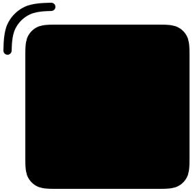

# Handle View

This project includes IBDesignables to play around with corner radii of the resize handles in [PanelKit](https://github.com/louisdh/panelkit).

The objective was to find a corner radius for the handle that visually matches the rounded rect (panel) at a certain distance.

`Main.storyboard` has a `CornerHandleView` and a `RoundedView` that provides the following outcome:

The draw properties are IBInspectables, so they can be edited from the storyboard to try out different results. The color of the IBDesignables is the view's tint color.

This is a quick test project made specifically for [PanelKit's resize feature](https://twitter.com/LouisDhauwe/status/915658275122745344), though I'm sure this might be useful for other projects.
